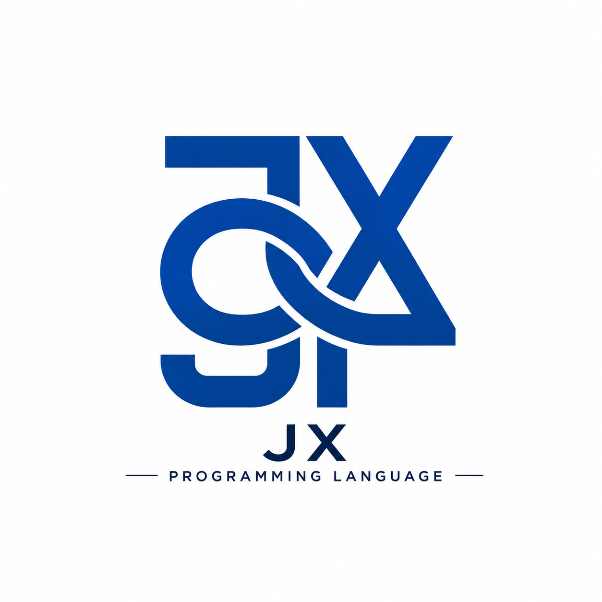

JX Language
version: 0.1
Author: João Manoel Martins Silveira

Year:
2026

========================
PORTUGUES
========================

Sobre:
JX é uma linguagem de programação experimental focada em simplicidade,
uso em console e criação de jogos.

Objetivo:
Permitir que qualquer pessoa consiga criar lógica, jogos e até IDEs
de forma simples e rápida.

Características:
- Sintaxe simples com {}
- Uso de Loop e If 
- Sistema de console próprio
- Input por Console.input e input.detect
- Renderização com Console.display, Console.back, back.line e back.linesave
- Suporte a Wait e Wait.frame

Exemplo:

Loop {
  tecla = input.detect()

  If(tecla == "w") then {
    Console.display("Cima")
  }

  Wait.frame(5)
}

Permissões:
- Pode usar a linguagem livremente
- Pode modificar
- Pode criar IDEs e ferramentas
- Pode criar jogos e projetos

Condições:
- Deve dar crédito ao autor
- Não pode remover o nome do criador
- Não pode reivindicar a linguagem como própria

========================
ENGLISH
========================

About:
JX is an experimental programming language focused on simplicity,
console usage and game creation.

Goal:
Allow anyone to create logic, games and even IDEs easily.

Features:
- Simple syntax using {}
- Loop If support
- Custom console system
- Input using Console.input and input.detect
- Rendering with Console.display, Console.back, back.line and back.linesave
- Support for Wait and Wait.frame

Example:

Loop {
  tecla = input.detect()

  If(tecla == "w") then {
    Console.display("Up")
  }

  Wait.frame(5)
}

Permissions:
- Free to use
- Can be modified
- Can create IDEs and tools
- Can create games and projects

Conditions:
- Must give credit to the author
- Cannot remove the author's name
- Cannot claim the language as your own
